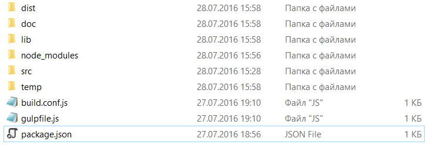

# Pip.WebUI Getting Started <br/> Step 1. Create application structure

### Setup development environment

If you don't have node.js installed on your computer, download and install it from https://nodejs.org/en/download/

Verify that you are running at least node v4.x.x and npm 3.x.x or older by running node -v and npm -v in a terminal/console window.

Install required build tools.
```bash
npm install bower -g
npm install gulp-cli -g
```

### Create project folder structure

```
├── src
│    ├── index.html
│    ├── index.js
│    ├── styles.less
├── package.json
├── gulpfile.js
├── build.conf.js
```

### Install dependencies

Create **package.json** file in the root folder, to define npm dependencies.

```javascript
{
  "name": "pip-webui-sample",
  "version": "1.0.0",
  "description": "Getting started sample for Pip.WebUI",
  "dependencies": {
  },
  "devDependencies": {
    "pip-webui": "^1.0.0",
    "pip-webui-tasks": "^1.0.0"
  }
}

```

Install npm dependencies by executing in command line:
```bash
npm install
```

Or create **bower.json** file in the root folder, to define bower dependencies.

```javascript
{
  "name": "pip-webui-sample",
  "version": "1.0.0",
  "description": "Getting started sample for Pip.WebUI",
  "dependencies": {
      "pip-webui": "^1.0.0"
  }
}

```

Install bower dependencies by executing in command line:
```bash
bower install
```

### Configure build tasks 

Create **gulpfile.js** file in the root folder, and define their build tasks using tasks provided **pip-webui-tasks** module.

```javascript
var gulp = require('gulp');

// Add all standard tasks    
require('pip-webui-tasks').all();

// Define build tasks        
gulp.task('build', ['build-dev', 'build-prod']);
gulp.task('rebuild', ['build-dev']);
gulp.task('clean', ['build-clean']);
gulp.task('launch', ['app-launch']);

// Set default task
gulp.task('default', ['build']);
```

Create **build.conf.js** file in the root folder and define configuration for the build tasks.

```javascript
module.exports = {
    module: {
        name: 'app',
        styles: 'styles'
    },
    file: {
        lib: [
            'node_modules/pip-webui/dist/**/*'
        ]
    }
};
```

For more information on build tasks and configuration see [pip-webui-tasks module](https://github.com/pip-webui/pip-webui-tasks).

### Create stubs for application source files

In the **/src** folder create the following tree file.

##### index.js
```javascript
(function () {
    
})();
```

##### index.html
```html
<!DOCTYPE html>
<html lang="en">
<head>
    <meta charset="UTF-8">
    <title>Pip.WebUI Getting Started</title>
    <link rel="stylesheet" href="styles.css"/>
    <script src="index.js"></script>
</head>
<body>

</body>
</html>
```

##### styles.less
```css
// Todo: add styles here
```

### Execute first build

In command line start the build process:
```bash
gulp build
```

If build is successful, in the root folder you can find two new folders **/lib** and **/dist**



Go to **/dist** folder, locate **index.html** file.  

Open your app by executing in command line:
```bash
gulp launch
```

You shall see an empty web page.


### Continue

[Go to step 2](https://github.com/pip-webui/pip-webui-sample/blob/master/step2/) to add Pip.WebUI libraries and create Angular boilerplate code in your application.
