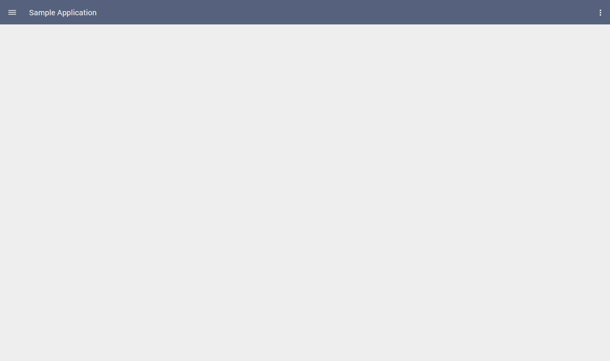
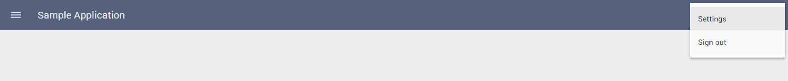
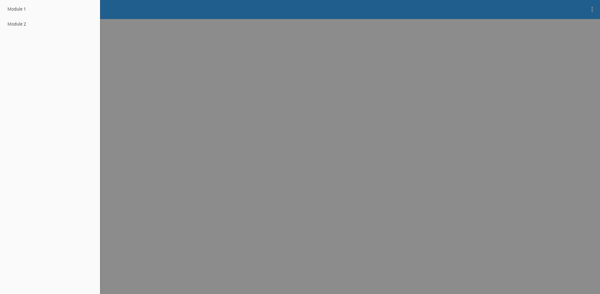

# Pip.WebUI Getting Started <br/> Step 3. Add global navigation

[Go to step 2](https://github.com/pip-webui/pip-webui-sample/blob/master/step2/Readme.md) to add **pip-webui** references.

### Add navigation components into index.html

**pip-main** tag is the container for the **pip-webui** UI.
Under **pip-main** add **pip-appbar** and **pip-sidenav** components.

```html
<body ng-app="app" ng-controller="appController">
    <pip-main>
        <pip-appbar></pip-appbar>
        <pip-sidenav></pip-sidenav>
    </pip-main>
</body>
```

Rebuild the application. You shall see an empty application with toolbar and sidenav.


### Configure AppBar

Load default iconset and define global actions and default application title inside application configuration section

```javascript
app.config(function ($mdIconProvider, pipAppBarProvider) {
    // Load default iconset
    $mdIconProvider.iconSet('icons', 'lib/images/icons.svg', 512);

    // Define global secondary actions (for actions popup menu) 
    pipAppBarProvider.globalSecondaryActions([
        {name: 'global.settings', title: 'Settings', state: 'settings'},
        {name: 'global.signout', title: 'Sign out', state: 'signout'}
    ]);

    // Set default application title
    pipAppBarProvider.appTitleText('Sample Application');
});
```

Now configure what will be shown on appbar when application loads

```javascript
app.controller('appController', function($scope, pipAppBar) {
        // Show application title
        pipAppBar.showAppTitleText('Sample Application'); 
        // Show icon to open sidenav
        pipAppBar.showMenuNavIcon();
        // Show button with tree dots for secondary actions
        pipAppBar.showLocalActions();
});
```

When you rebuild the application, you shall see the following



When you click on tree dots on the right, a popup with secondary actions shall open



### Configure SideNav

Configure two links in sidenav inside application configuration section

```javascript
app.config(function ($mdIconProvider, pipAppBarProvider, pipSideNavProvider) {
    ...
    
    pipSideNavProvider.sections([
        {
            links: [
                {title: 'Module 1', url: '/module_1'},
                {title: 'Module 2', url: '/module_2'}
            ]
        }
    ]);
});
```

Rebuild and open the application



### Continue

For more information on Appbar and SideNav, please, visit [pip-webui-nav module](https://github.com/pip-webui/pip-webui-nav)

[Go to step 4](https://github.com/pip-webui/pip-webui-sample/blob/master/step4/) to add sign in and sign up pages.
