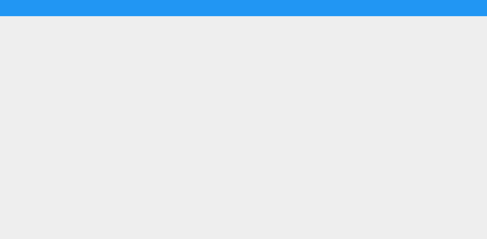
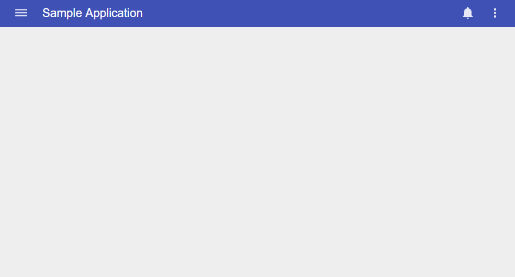

# Pip.WebUI Getting Started <br/> Step 3. Add pip-webui components

[Go to step 2](https://github.com/pip-webui/pip-webui-tutorial/blob/master/step2/Readme.md) to add **angular** components.

### Include navigation components into the application

Add references to **angular-material** and **pip-webui** into module references:

```javascript
angular
    .module('app', [
        // >>>> Changes start here >>>>
        'ngMaterial',
        'pipLayout', 
        'pipNav', 
        'pipControls',
        'pipBehaviors',
        'pipServices', 
        'pipTheme',
        'pipSettings',
        'pipButtons',
        'pipLocations'
        // >>>> Changes end here >>>>
    ])
```

### Add AppBar and SideNav into index.html

Place **pip-appbar** and **pip-sidenav** components under **pip-main** tag.

```html
<body ng-app="app" ng-controller="appController as vm">
    <pip-main>
        <pip-appbar>
            <pip-nav-icon></pip-nav-icon>
            <pip-breadcrumb></pip-breadcrumb>
            <div class="flex"></div>
            <pip-primary-actions class="flex-fixed"></pip-primary-actions>
            <pip-secondary-actions class="flex-fixed"></pip-secondary-actions>
        </pip-appbar>
        <pip-sidenav>
            <pip-nav-menu></pip-nav-menu>
        </pip-sidenav>
        <pip-main-body ui-view></pip-main-body>
    </pip-main>
</body>
```

Rebuild the application. You shall see an empty material application with a toolbar and sidenav.



### Configure application

Load the default iconset, define global actions and default application title inside the application configuration section.

We will create a page for the global actions later. For now, you can see a routing error page if you try to trigger them.

```javascript
// >>>> Changes start here >>>>
function configureApp(
    $mdIconProvider: ng.material.IIconProvider, 
    pipSideNavProvider: pip.nav.ISideNavProvider, 
    pipNavMenuProvider: pip.nav.INavMenuProvider, 
    pipNavHeaderProvider: pip.nav.INavHeaderProvider,
    pipAppBarProvider: pip.nav.IAppBarProvider, 
    pipNavIconProvider: pip.nav.INavIconProvider,
    pipActionsProvider: pip.nav.IActionsProvider, 
    pipBreadcrumbProvider: pip.nav.IBreadcrumbProvider, 
 ) {
    $mdIconProvider.iconSet('icons', 'images/icons.svg', 512);
    pipSideNavProvider.type = 'popup';

    pipNavHeaderProvider.title = "Sample application";
    pipNavHeaderProvider.subtitle = "Learn how to use pip-webui";
    
    pipNavMenuProvider.sections = [
        {
            name: 'main',
            links: [
                { name: 'nodes', icon: 'icons:grid', title: 'Nodes', state: 'nodes' },
                { name: 'events', icon: 'icons:progress', title: 'Events', state: 'events' },
                { name: 'settings', icon: 'icons:config', title: 'Settings', state: 'settings.sample' }
            ]
        },
        {
            name: 'signout',
            links: [
                { name: 'signout', icon: 'icons:exit', title: 'Sign out', event: 'appSignout' }
            ]
        }
    ];

    // Configure appbar    
    pipBreadcrumbProvider.text = "Sample Application";
    pipNavIconProvider.setMenu();
    pipActionsProvider.primaryGlobalActions = [
            { name: 'global.notifications', icon: 'icons:bell', count: 0, event: 'appNotificationsClicked', subActions: []  }
    ];

    pipActionsProvider.secondaryGlobalActions = [
        { name: 'global.settings', title: 'Settings', state: 'settings.sample', subActions: [] },
        { name: 'global.signout', title: 'Sign out', event: 'appSignout', subActions: [] }
    ];
}
// >>>> Changes end here >>>>
```

When you rebuild the application, you will see the following page:



### Continue

For more information on Appbar and SideNav, please, visit [pip-webui-nav module](https://github.com/pip-webui/pip-webui-nav)

[Go to step 4](https://github.com/pip-webui/pip-webui-tutorial/blob/master/step4/) to add pages and navigation.

