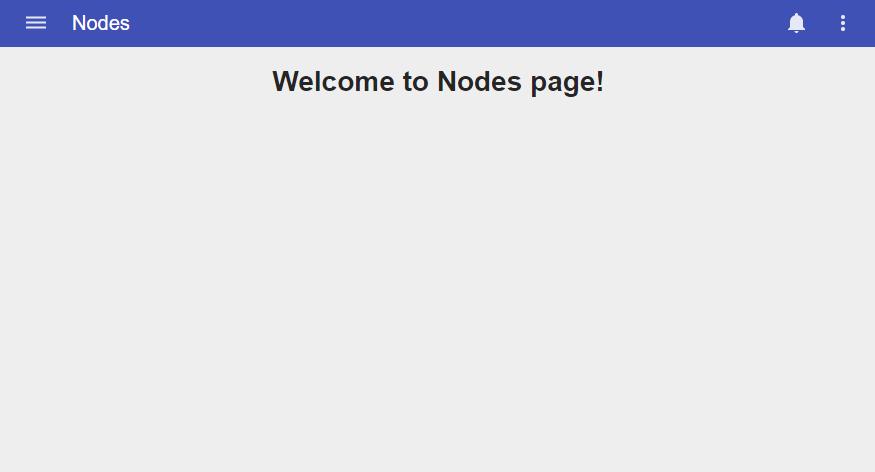

# Pip.WebUI Getting Started <br/> Step 4. Add pages and navigation

[Go to step 3](https://github.com/pip-webui/pip-webui-sample/blob/master/step3/) to add pip-webui components.

### Add notes page

Add **nodes.html** file into **/src** folder:

```html
<h1>Welcome to Nodes page!</h1>
```
Then add **nodes.ts** file with controller and route configuration:

```javascript
'use strict';

function configureNodeRoutes(
    $stateProvider: ng.ui.IStateProvider
) {
    "ngInject";

    // Configure module routes
    $stateProvider.state('nodes', {
        url: '/nodes',
        controller: NodesController,
        controllerAs: 'vm',
        templateUrl: 'nodes.html'
    });
}

class NodesController {
    public constructor(
        pipBreadcrumb: pip.nav.IBreadcrumbService
    ) {
        pipBreadcrumb.text = "Nodes";
    }
}

angular
    .module('app.Nodes', [ ])
    .config(configureNodeRoutes)
    .controller('nodesController', NodesController);
```

### Add events page 

Similar to nodes, add files for events page.

Add **events.html** file:

```html
<h1>Welcome to Events page!</h1>
```

Add **events.ts** file:

```javascript
'use strict';

function configureEventRoutes(
    $stateProvider: ng.ui.IStateProvider
) {
    "ngInject";

    // Configure module routes
    $stateProvider.state('events', {
        url: '/events',
        controller: EventsController,
        controllerAs: 'vm',
        templateUrl: 'events.html'
    });
}

class EventsController {
    public constructor(
        pipBreadcrumb: pip.nav.IBreadcrumbService
    ) {
        pipBreadcrumb.text = "Events";
    }
}

angular
    .module('app.Events', [ ])
    .config(configureEventRoutes)
    .controller('eventsController', EventsController);
```

### Include compiled HTML templates

Add reference to **./temp/pip-webui-sample-html.js** file that contains html pages compiled into javascript templates.
Later this step can be removed and done automatically.

```javascript
    browserify: {
        entries: [ 
            './temp/pip-webui-sample-html.js',
            './src/index.ts'
        ]
    }
```

### Add references to page modules into index.ts

Open **index.ts** file and import files containing code of nodes and events pages:

```javascript
'use strict'

import './nodes.ts';
import './events.ts';
```

Add references to page modules into the main module:

```javascript
angular
    .module('app', [
        'ngMaterial',
        'pipLayout', 
        'pipNav', 
        'pipAppBar',        
        'pipControls',
        'pipBehaviors',
        'pipServices', 
        'pipTheme',
        'pipSettings',
        'pipButtons',

        'app.Templates',
        'app.Events',
        'app.Nodes'
    ])
    .config(configureApp)
    .controller('appController', AppController);
```

Configure default route in application configuration:

```javascript
function configureApp(
    $mdIconProvider: ng.material.IIconProvider, 
    $urlRouterProvider,
    pipSideNavProvider: pip.nav.ISideNavProvider, 
    pipNavMenuProvider: pip.nav.INavMenuProvider, 
    pipAppBarProvider: pip.nav.IAppBarProvider, 
    pipNavIconProvider: pip.nav.INavIconProvider,
    pipActionsProvider: pip.nav.IActionsProvider, 
    pipBreadcrumbProvider: pip.nav.IBreadcrumbProvider
 ) {
 ...
 
    $urlRouterProvider.otherwise("/nodes");
} 
```

When you rebuild and reopen the application you shall see the following result:



### Continue

[Go to step 5](https://github.com/pip-webui/pip-webui-sample/blob/master/step5/) to add settings and help pages.
