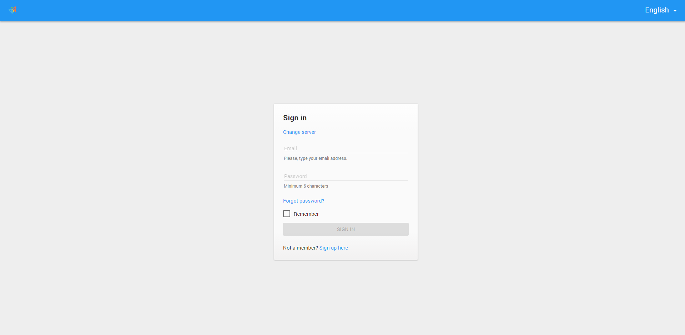
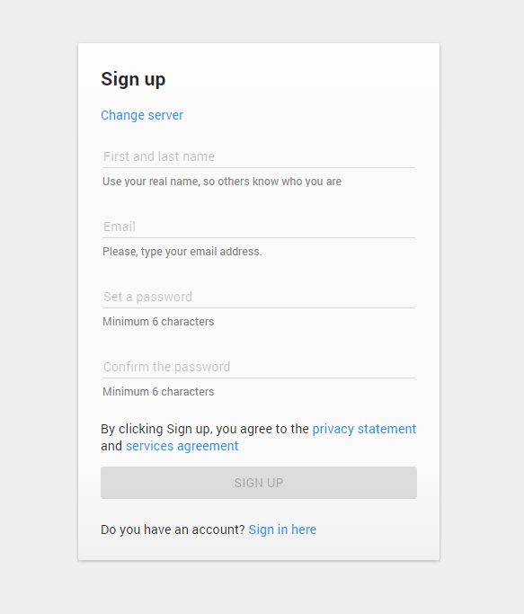

# Pip.WebUI Getting Started <br/> Step 4. Add sign in and sign up

[Go to step 3](https://github.com/pip-webui/pip-webui-sample/blob/master/step3/) to add global application configuration.

### Include entry pages into the application

Add **pipEntry** into the application module references

```javascript
var app = angular.module('app', [
        // pipWebUI modules
        'pipRest', 'pipErrorHandling', 'pipLayout', 'pipNav', 'pipEntry',

        // Application templates
        'app.Templates'
]);
```

### Configure routing to signin page

Now add default routing states into configuration section. 
Unauthorized users shall see **signin** page when they open the application.
After successful signin they shall switch to **nodes** page.

```javascript
app.config(function ($mdIconProvider, $urlRouterProvider, pipSideNavProvider, pipAppBarProvider) {
    ...
     // Configure default states
     pipAuthStateProvider.unauthorizedState('signin');
     pipAuthStateProvider.authorizedState('nodes');
    
    $urlRouterProvider.otherwise(function ($injector, $location) {
        return $location.$$path === '' ? '/signin' : '/nodes';
    });
});
```


### Add link to signout

To support signout, add link to **/signout** route into the Sidenav config inside application configuration section
To go to **signin** page add **Sign Out** link with such url:**/signout** to sidenav sections
It will look like this:

```javascript
app.config(function ($mdIconProvider, pipSideNavProvider, pipAppBarProvider) {
    ...
    pipSideNavProvider.sections([
        {
            links: [
                {title: 'nodes', url: '/nodes'},
                {title: 'events', url: '/events'}
            ]
        },
        {
            links: [
                {title: 'Sign Out', url: '/signout'}
            ]
        }
    ]);
    ...
});
```


Rebuild the application. Now you shall see **sing in** when you open application in the browser



When you click **Sign up here**  **sign up** form will open up



After **sign up** user will be transfered to **post sign up** form where he can enter additional details about himself.
On **Continue** application shall open default **nodes** page.

Todo: Add screen with empty nodes page

### Continue

[Go to step 5](https://github.com/pip-webui/pip-webui-sample/blob/master/step5/) to add settings and help pages.
