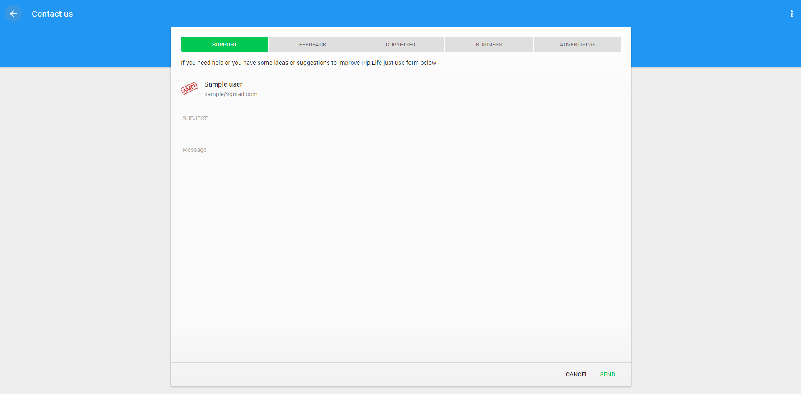
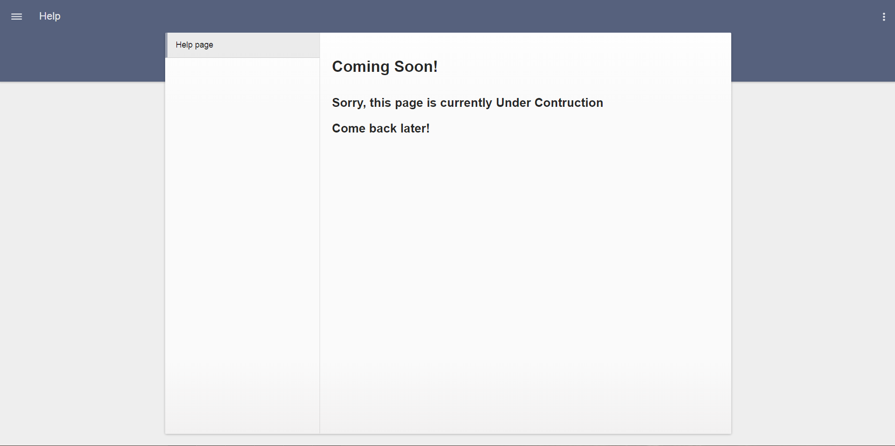

# Pip.WebUI Getting Started <br/> Step 5. Add settings, feedback and help pages

[Go to step 4](https://github.com/pip-webui/pip-webui-sample/blob/master/step4/) to add sign-in and sign-up pages.

### Include entry pages into the application

Add **pipSettings**, **pipUserSettings**, **pipSupport** and **pipHelp** into the application module references:

```javascript
var app = angular.module('app', [
        // pipWebUI modules
        'pipRest', 'pipLayout', 'pipErrorHandling', 'pipWebuiTests', 'pipNav', 'pipEntry',
        'pipSettings', 'pipUserSettings', 'pipSupport', 'pipHelp',
        
        // Application templates
        'app.Templates'
]);
```

### Add page links to SideNav

Inside the application configuration section add links to settings, help and feedback pages:

```javascript
app.config(
    function (pipSideNavProvider, $mdIconProvider, pipAppBarProvider, pipAuthStateProvider, 
                  pipSettingsProvider, pipHelpProvider, $urlRouterProvider, pipRestProvider) {
        
        ...

        pipSideNavProvider.sections([
            {
                links: [
                    {title: 'Nodes', url: '/nodes'},
                    {title: 'Events', url: '/events'}
                ]
            },
            {
                links: [
                    {title: 'Settings', url: '/settings'},
                    {title: 'Help', url: '/help'},
                    {title: 'Feedback', url: '/feedback'}
                ]
            },
            {
                links: [
                    {title: 'Sign Out', url: '/signout'}
                ]
            }
        ]);
    }
);
```

Rebuild and reopen the application. Now you will see Settings and Feedback pages with default content:


Settings page:


Feedback page:



### Add help page.

Now we will implement a sample help page. Create **./src/help** folder and place there a new file **help.html** with the content below.

```html
<div>
        <div class="text-title tm0 bm24">
            <h2>Coming Soon!</h2>

            <h3 style="margin-top: 40px;">Sorry, this page is currently Under Contruction</h3>
            <h3>Come back later!</h3>
        </div>
</div> 
```

Inside the application configuration section add help page:

```javascript
app.config(
    function (pipSideNavProvider, $mdIconProvider, pipAppBarProvider, pipAuthStateProvider, 
                  pipSettingsProvider, pipHelpProvider, $urlRouterProvider, pipRestProvider) {
        
            ...
        
            // Register custom help page
            pipHelpProvider.addTab({
                state: 'help',
                title: 'Help page',
                stateConfig: {
                    controller: function($timeout) {
                        $timeout(function() {
                            $('pre code').each(function(i, block) {
                                Prism.highlightElement(block);
                            });
                        });
                    },
                    url: '/help',
                    auth: false,
                    templateUrl: 'help/help.html'
                }
            });
    }
);
```

Rebuild and reopen the application. Now you will see Help pages with default content.

Help page:


Todo: Add a screenshot of the help page. We shall also implement couple default pages similar to user settings (talk to AlexM)

### Continue

[Go to step 6](https://github.com/pip-webui/pip-webui-sample/blob/master/step6/) to add Nodes page with tiles view.
