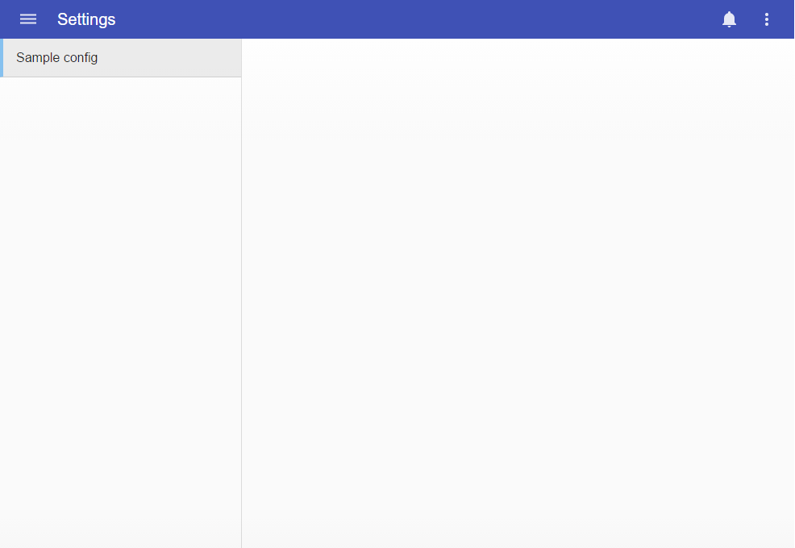

# Pip.WebUI Getting Started <br/> Step 5. Add settings page

[Go to step 4](https://github.com/pip-webui/pip-webui-tutorial/blob/master/step4/) to add pages and navigation.

### Add settings page

Add **settings_sample.html** file with settings tab view into **/src/settings** folder:

```html
<h1>Welcome to Settings sample tab!</h1>
```

Add configuration and settings tab controller into **settings_sample.ts** file in **/src/settings** folder:

```javascript
'use strict';

function configureSampleTab(
    pipSettingsProvider: pip.settings.ISettingsProvider
) {
    pipSettingsProvider.addTab({
        state: 'sample',
        title: 'Sample config',
        auth: true,
        stateConfig: {
            url: '/sample',
            templateUrl: 'settings/settings_sample.html',
            controller: SettingsSampleController,
            controllerAs: 'vm'
        }
    });

    (<any>pipSettingsProvider).setDefaultTab('sample');
}

class SettingsSampleController {
    public constructor(
        pipNavService: pip.nav.INavService,
    ) {
        pipNavService.appbar.show();
        pipNavService.sidenav.show();
    }
}

angular
    .module('app.Settings.Sample', [ ])
    .config(configureSampleTab);
```

### Add references to settings page into index.ts

Open **index.ts** file and import files containing code of settings page:

```javascript
'use strict';

import './nodes/nodes';
import './events/events';
// >>>> Changes start here >>>>
import './settings/settings_sample';
// >>>> Changes end here >>>>

...

angular
    .module('app', [
        'ngMaterial',
        'pipLayout', 
        'pipNav', 
        'pipAppBar',        
        'pipControls',
        'pipBehaviors',
        'pipServices', 
        'pipTheme',
        'pipSettings',
        'pipButtons',
        'pipLocations',

        'app.Templates',
        'app.Events',
        'app.Nodes',
// >>>> Changes start here >>>>
        'app.Settings.Sample'
// >>>> Changes end here >>>>
    ])
    .config(configureApp)
    .controller('appController', AppController);
```

Added settings page shall look like this:


### Continue

[Go to step 6](https://github.com/pip-webui/pip-webui-tutorial/blob/master/step6/) to add Nodes page with tiles view.
