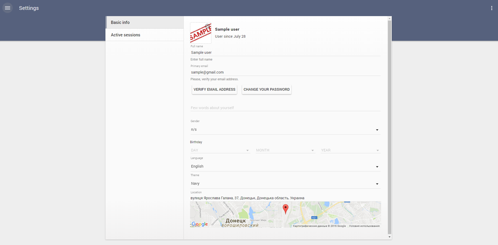

# Pip.WebUI Getting Started <br/> Step 5. Add settings, feedback and help pages

[Go to step 4](https://github.com/pip-webui/pip-webui-sample/blob/master/step4/) to add sign in and sign up pages.

### Include entry pages into the application

Add **pipSettings**, **pipUserSettings**, **pipSupport** and **help** into the application module references

```javascript
var app = angular.module('app', [
        // pipWebUI modules
        'pipRest', 'pipErrorHandling', 'pipLayout', 'pipNav', 'pipEntry',
        'pipSettings', 'pipUserSettings', 'pipSupport', 'pipHelp',
        
        // Application templates
        'app.Templates'
]);
```

### Add page links to SideNav

Inside application configuration section add links to settings, help and feedback pages

```javascript
pipSideNavProvider.sections([
    {
        links: [
            {title: 'Nodes', url: '/nodes'},
            {title: 'Events', url: '/events'}
        ]
    },
    {
        links: [
            {title: 'Settings', url: '/settings'},
            {title: 'Help', url: '/help'},
            {title: 'Feedback', url: '/feedback'}
        ]
    }
    {
        links: [
            {title: 'Sign Out', url: '/signout'}
        ]
    }
]);
```

Rebuild and reopen the application. Now you shall see Settings, Feedback and Help pages with default content.



Todo: Add screenshot of the help page. We shall also implement couple default pages similar to user settings (talk to AlexM)

Todo: Add screenshot of the feedback page.

### Continue

[Go to step 6](https://github.com/pip-webui/pip-webui-sample/blob/master/step6/) to add Nodes page with tiles view.
