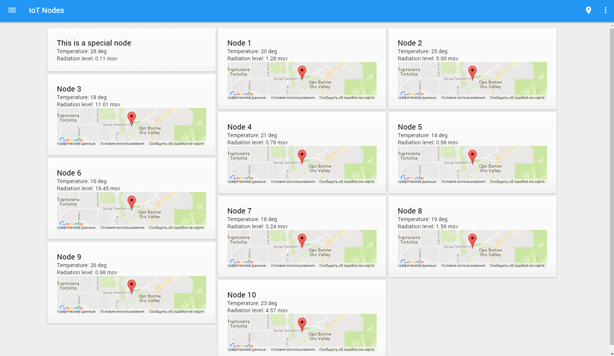

# Pip.WebUI Getting Started <br/> Step 6. Add Nodes page with tiles view

[Go to step 5](https://github.com/pip-webui/pip-webui-sample/blob/master/step5/) to add settings, feedback and help pages.

### Create nodes tiles view

Create **/nodes** folder under **/src**. Place there **nodes.html** file with the content below.
It will display a tile view with IoT nodes showing their name, measurements and current location

```html
<pip-tiles class="layout-fill pip-no-tabs" column-width="440">
    <div class="masonry-brick pip-tile w440-flex " ng-repeat="node in nodes">
        <div class="p24-flex">
            <div class="pip-details-title">
                <p class="pip-title">{{ node.name }}</p>
            </div>
            <div>
                Temperature: {{ node.temperature }}
            </div>
            <div>
                Radiation level: {{ node.radiation_level }}
            </div>
            <pip-location pip-location-pos="location_point"
                          pip-location-name="location_point.name"
                          pip-location-resize="resizeTiles()">
            </pip-location>
        </div>
    </div>
</pip-tiles>
```

### Create nodes controller

Create **nodes.js** file under **/src/nodes** folder and copy the following code there

Todo: Each node shall have its own location!
Todo: Can we add the hook to resize tiles into the framework?

```javascript
(function (angular) {

    var thisModule = angular.module('nodesModule', []);

    thisModule.controller('nodesController', function($scope, pipAppBar) {
        // Show page title
        pipAppBar.showTitleText('Nodes');
        // Show menu icon to open sidenav
        pipAppBar.showMenuNavIcon();
        // Show local page actions
        pipAppBar.showLocalActions();
        // Add shadow under the appbar
        pipAppBar.showShadow();

        $scope.nodes = [
            {name: 'Node 1', temperature: '20 deg', radiation_level: '1.28 msv'},
            {name: 'Node 2', temperature: '25 deg', radiation_level: '5.00 msv'},
            {name: 'Node 3', temperature: '18 deg', radiation_level: '11.01 msv'},
            {name: 'Node 4', temperature: '21 deg', radiation_level: '0.78 msv'},
            {name: 'Node 5', temperature: '14 deg', radiation_level: '0.98 msv'},
            {name: 'Node 6', temperature: '16 deg', radiation_level: '19.45 msv'},
            {name: 'Node 7', temperature: '18 deg', radiation_level: '3.24 msv'},
            {name: 'Node 8', temperature: '19 deg', radiation_level: '1.56 msv'},
            {name: 'Node 9', temperature: '26 deg', radiation_level: '0.98 msv'},
            {name: 'Node 10', temperature: '23 deg', radiation_level: '4.57 msv'}
        ];
        
        $scope.location_point = {
            type: 'Point',
            coordinates: [32.393603, -110.982593],
            name: 'Tucson'
        };
        
        // Hook to resize tiles
        $scope.resizeTiles = function() {
            $scope.$broadcast('pipResizeLayout');
        };
    });

})(window.angular);
```

### Add page into the application

Add **nodesModule** into application module references in **index.js**

```javascript
var app = angular.module('app', [
    ...
    
    // Sample application modules
    'nodesModule'
]);
```

Make changes to the routing states in configuration section

```javascript
app.config(
    function (pipSideNavProvider, $mdIconProvider, pipAppBarProvider, pipAuthStateProvider, 
              pipSettingsProvider, pipHelpProvider, $urlRouterProvider) {
        ...
        // Configure routing states
        pipAuthStateProvider
            .state('nodes', { // <---- Pay attention!
                url: '/nodes', // <---- Pay attention!
                controller: 'nodesController', // <---- Pay attention!
                templateUrl: 'nodes/nodes.html', // <---- Pay attention!
                auth: true
            })
            .state('events', {
                url: '/events',
                controller: 'eventsController',
                auth: true
            });
        ...
    }
);
```

Remove old **nodesController** from **index.js**

```javascript
// Remove
//app.controller('nodesController', function($scope) {
//        // Todo: Add controller logic for IoT Nodes page
//});
```

Rebuild and reopen the application. You shall see now

Todo: Update the picture to remove that "special tile"



Resize the window and see those the page responses to fit the smaller screen

Todo: Add picture with the page phone size

### Continue

[Go to step 7](https://github.com/pip-webui/pip-webui-sample/blob/master/step7/) to add Events page with table view
