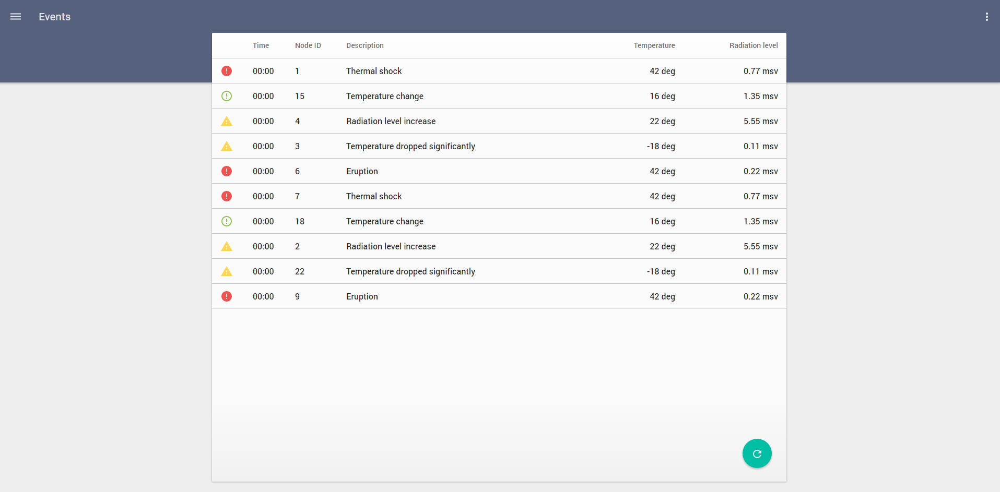
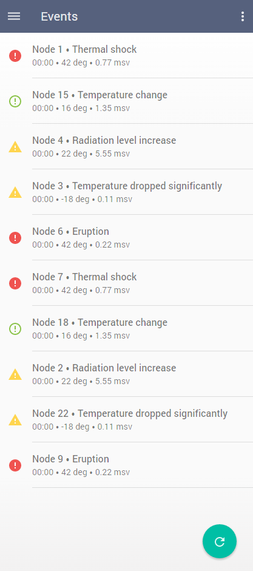

# Pip.WebUI Getting Started <br/> Step 7. Add Events page with table view

[Go to step 6](https://github.com/pip-webui/pip-webui-sample/blob/master/step6/) to add Nodes page with tiles view.

### Create events table view

Create **/events** folder under **/src**. Place there events.html file with the content presented below. 
The page will show events from IoT nodes as a table on Desktop and Table and as a list on Phones.

Todo: Make the page responsive. Add list on phones
```html
<md-toolbar class="pip-appbar-ext">
</md-toolbar>

<pip-document>
    <div ng-show="$mdMedia('gt-xs')">
        <table class="w-stretch">
            <thead class="color-secondary-text">
                <tr class="h48 text-left">
                    <th class="divider-bottom"><!--For icons--></th>
                    <th class="divider-bottom">Time</th>
                    <th class="divider-bottom">Node ID</th>
                    <th class="divider-bottom">Description</th>
                    <th class="text-right divider-bottom">Temperature</th>
                    <th class="text-right rp16 divider-bottom">Radiation level</th>
                </tr>
            </thead>
            <tbody>
                <tr class="h48 text-subhead2 divider-bottom" ng-repeat="event in events">
                    <td class="lp16 divider-bottom">
                        <md-icon ng-style="{color: iconColors[event.icon]}"
                                 md-svg-icon="icons:{{ event.icon }}">
                        </md-icon>
                    </td>
                    <td class="divider-bottom">00:00</td>
                    <td class="divider-bottom">{{ event.node_id }}</td>
                    <td class="divider-bottom">{{ event.description }}</td>
                    <td class="text-right divider-bottom">{{ event.temperature }}</td>
                    <td class="text-right rp16 divider-bottom">{{ event.rad_level }}</td>
                </tr>
            </tbody>
        </table>
    </div>
    <div ng-show="$mdMedia('xs')">
        <div ng-repeat="event in events" class="layout-row layout-align-start-center">
            <div class="flex-fixed lp16 rp16">
                <md-icon ng-style="{color: iconColors[event.icon]}"
                         md-svg-icon="icons:{{ event.icon }}">
                </md-icon>
            </div>
            <div class="flex layout-column layout-align-start-start divider-bottom color-secondary-text tp16 bp16">
                <div class="flex text-subhead2 w-stretch">
                    <span >Node {{ event.node_id }}</span> ⦁
                    <span >{{ event.description }}</span>
                </div>
                <div class="flex w-stretch">
                    <span >00:00</span> ⦁
                    <span >{{ event.temperature }}</span> ⦁
                    <span >{{ event.rad_level }}</span>
                </div>
            </div>
        </div>
    </div>
    <md-button class="md-fab md-accent md-fab-bottom-right" aria-label="refresh">
        <md-tooltip md-direction="left">Refresh</md-tooltip>
        <md-icon md-svg-icon="icons:reload"></md-icon>
    </md-button>
</pip-document>
```

### Create events controller

Create **events.js** file under **/src/events** folder and copy there the following code

```javascript
(function (angular) {

    var thisModule = angular.module('eventsModule', []);

    thisModule.controller('eventsController', function($scope, pipAppBar, $mdMedia) {
        // Show page title
        pipAppBar.showTitleText('Events');
        // Show menu icon to open sidenav
        pipAppBar.showMenuNavIcon();
        // Show local page actions
        pipAppBar.showLocalActions();
        // Add shadow under the appbar
        pipAppBar.showShadow();
        
        // Initialize service for changing layouts when the screen size changed
        $scope.$mdMedia = $mdMedia;
        
        $scope.events = [
            {node_id: '1', description: 'Thermal shock', temperature: '42 deg', rad_level: '0.77 msv', icon: 'warn-circle'},
            {node_id: '15', description: 'Temperature change', temperature: '16 deg', rad_level: '1.35 msv', icon: 'info-circle-outline'},
            {node_id: '4', description: 'Radiation level increase', temperature: '22 deg', rad_level: '5.55 msv', icon: 'warn-triangle'},
            {node_id: '3', description: 'Temperature dropped significantly', temperature: '-18 deg', rad_level: '0.11 msv', icon: 'warn-triangle'},
            {node_id: '6', description: 'Eruption', temperature: '42 deg', rad_level: '0.22 msv', icon: 'warn-circle'},
            {node_id: '7', description: 'Thermal shock', temperature: '42 deg', rad_level: '0.77 msv', icon: 'warn-circle'},
            {node_id: '18', description: 'Temperature change', temperature: '16 deg', rad_level: '1.35 msv', icon: 'info-circle-outline'},
            {node_id: '2', description: 'Radiation level increase', temperature: '22 deg', rad_level: '5.55 msv', icon: 'warn-triangle'},
            {node_id: '22', description: 'Temperature dropped significantly', temperature: '-18 deg', rad_level: '0.11 msv', icon: 'warn-triangle'},
            {node_id: '9', description: 'Eruption', temperature: '42 deg', rad_level: '0.22 msv', icon: 'warn-circle'}
        ];
        
        $scope.iconColors = {
            'warn-circle': '#EF5350',
            'info-circle-outline': '#8BC34A',
            'warn-triangle': '#FFD54F'
        };
    });

})(window.angular);
```

### Add page into the application

Add **eventsModule** into application module references in index.js

```javascript
var app = angular.module('app', [
    ...
    
    // Sample application modules
    'nodesModule', 'eventsModule'
]);
```

Make changes to the routing states in configuration section

```javascript
app.config(
    function (pipSideNavProvider, $mdIconProvider, pipAppBarProvider, pipAuthStateProvider, 
              pipSettingsProvider, pipHelpProvider, $urlRouterProvider) {
        ...

        // Configure states of application
        pipAuthStateProvider
            .state('nodes', {
                url: '/nodes',
                controller: 'nodesController',
                templateUrl: 'nodes/nodes.html',
                auth: true
            })
            .state('events', { // <---- Pay attention!
                url: '/events', // <---- Pay attention!
                controller: 'eventsController', // <---- Pay attention!
                templateUrl: 'events/events.html', // <---- Pay attention!
                auth: true
            });
        ...
    }
);
```

Remove old **eventsController** from **index.js**

```javascript
// Remove
//app.controller('eventsController', function($scope) {
//        // Todo: Add controller logic for IoT Events page
//});
```

Rebuild and reopen the application. You shall see now



Resize browser windows to the size of a phone



### Continue

[Go to step 8](https://github.com/pip-webui/pip-webui-sample/blob/master/step8/) to show notifications.
