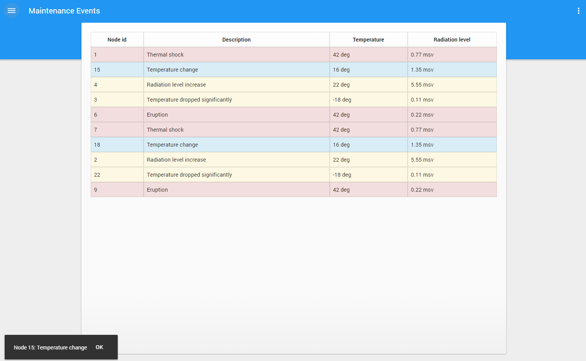

# Pip.WebUI Getting Started <br/> Step 8. Show notifications

[Go to step 7](https://github.com/pip-webui/pip-webui-sample/blob/master/step7/) to add Maintenance Events page with table view.

### Update your **pipWebUISampleController** for imitation receiving data.

```javascript
thisModule.controller('pipWebUISampleController', function($scope, pipAppBar, pipToasts, $interval) {
        
        // Move events from 'maintenanceEventsController'
        $scope.events = [
            {node_id: '1', description: 'Thermal shock', temperature: '42 deg', rad_level: '0.77 msv', type: 'danger'},
            {node_id: '15', description: 'Temperature change', temperature: '16 deg', rad_level: '1.35 msv', type: 'info'},
            {node_id: '4', description: 'Radiation level increase', temperature: '22 deg', rad_level: '5.55 msv', type: 'warning'},
            {node_id: '3', description: 'Temperature dropped significantly', temperature: '-18 deg', rad_level: '0.11 msv', type: 'warning'},
            {node_id: '6', description: 'Eruption', temperature: '42 deg', rad_level: '0.22 msv', type: 'danger'},
            {node_id: '7', description: 'Thermal shock', temperature: '42 deg', rad_level: '0.77 msv', type: 'danger'},
            {node_id: '18', description: 'Temperature change', temperature: '16 deg', rad_level: '1.35 msv', type: 'info'},
            {node_id: '2', description: 'Radiation level increase', temperature: '22 deg', rad_level: '5.55 msv', type: 'warning'},
            {node_id: '22', description: 'Temperature dropped significantly', temperature: '-18 deg', rad_level: '0.11 msv', type: 'warning'},
            {node_id: '9', description: 'Eruption', temperature: '42 deg', rad_level: '0.22 msv', type: 'danger'}
        ];
        
        var i = 0,
            stopTime = $interval(addNextToast, 10000); // use angular $interval for imitation receiving messages every 10 sec.

        function addNextToast() { 
            if (i == $scope.events.length) {
                $interval.cancel(stopTime);
            } else {
                // Function to display notification
                pipToasts.showNotification('Node ' + $scope.events[i].node_id + ': ' + $scope.events[i].description);
                i++;
            }
        }

    });
```

Update page and you shall see toasts in the lower left corner:



### Continue

[Go to step 9](https://github.com/pip-webui/pip-webui-sample/blob/master/step9/) to add map view for IoT Nodes page.
