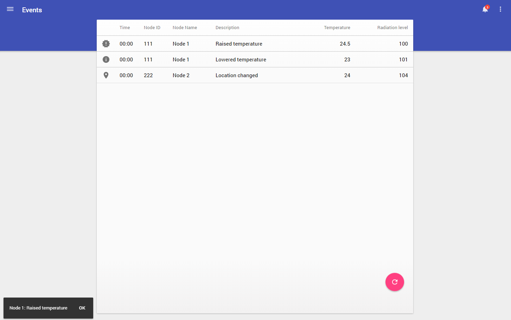
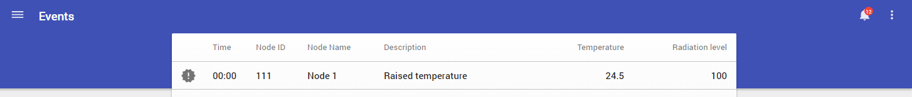
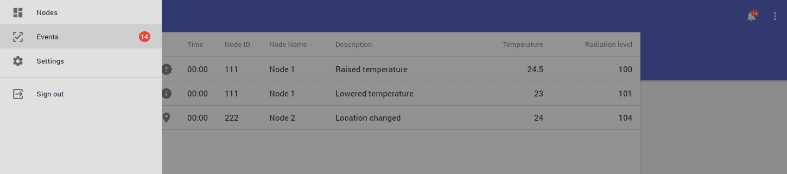

# Pip.WebUI Getting Started <br/> Step 8. Show notifications

[Go to step 7](https://github.com/pip-webui/pip-webui-sample/blob/master/step7/) to add Events page with table view.

### Show notifications as toast messages

Add new service to application. Create file **notifications.ts** in **/src/notifications** and add the following code:

```javascript
export interface INotificationService {
    start(): void;
    stop(): void;
    data(data: string[]): void;
}

export class NotificationAction {
    static Ok: string = "OK";
}

export class NotificationService implements INotificationService {
    private _$interval: angular.IIntervalService;
    private _stopTime: any;
    private _showCount: number = 0;
    private _interval: number = 20000;
    private _pipNavService: pip.nav.INavService;
    private _pipToasts: any;
    private _data: string[] = [];

    constructor(
        $interval: angular.IIntervalService,
        pipNavService: pip.nav.INavService,
        pipToasts: any
    ) {
        "ngInject";

        this._$interval = $interval;
        this._pipNavService = pipNavService;
        this._pipToasts = pipToasts;
    }

    private show () {
        let index;

        this._showCount++;
        index = this._data.length > this._showCount ? this._showCount: this._showCount % this._data.length;

        this.updateCounts();
        // Show a toast message
        this._pipToasts.showNotification(this._data[index], [NotificationAction.Ok], () => {});
    }

    private updateCounts() {
        // Show badge with number of notifications in application bar actions
        this._pipNavService.actions.updateCount('global.notifications', this._showCount);
        // Show badge with number of notifications in side navigation menu link
        this._pipNavService.menu.updateCount('events', this._showCount);
    }

    public start () {
        if (this._data.length === 0) return;

        this._stopTime = this._$interval(() => { this.show(); }, this._interval);
    }

    public stop () {
        this._$interval.cancel(this._stopTime);
        this._showCount = 0;
        this.updateCounts();
    }

    public data(data: string[]) {
        this._data = data;
    }

}

angular.module('app.Notifications', [])
    .service('notificationService', NotificationService);
```

Import **notifications.ts** and add notifications module in **index.ts**:

```javascript
 'use strict';

...
import './notifications/notifications';
...

angular
    .module('app', [
        'ngMaterial',
        'pipLayout', 
        'pipNav', 
        'pipControls',
        'pipBehaviors',
        'pipServices', 
        'pipTheme',
        'pipSettings',
        'pipButtons',
        'pipLocations',

        'app.Templates',
        'app.Events',
        'app.Nodes',
        'app.Settings.Sample',
        'app.Notifications' //<------ Pay attention!
    ])
    .config(configApp)
    .controller('appController', AppController);
```

Import **notification service interface** and update **events controller**:

```javascript
'use strict';

import { INotificationService } from '../notifications/notifications';

...

class EventsController {
    public constructor(
        pipBreadcrumb: pip.nav.IBreadcrumbService,
        pipMedia: pip.layouts.IMediaService,
        notificationService: INotificationService <------ Pay attention!
    ) {
        ...

        this.notificationService = notificationService;

        notificationService.data([
            this.events[0].node_name + ': ' + this.events[0].description,
            this.events[1].node_name + ': ' + this.events[1].description,
            this.events[2].node_name + ': ' + this.events[2].description
        ]);

        notificationService.start();
    }
    
    public reloadNotifications() {
        this.notificationService.stop();
        this.notificationService.start();
    }
    
    public pipMedia: pip.layouts.IMediaService;
    public events: IoTEvent[] = [];
    public notificationService: INotificationService; //<------ Pay attention!
}

...

```

Update **events.html**. Add **ng-click** attribute to button:

```html
 ...
    <md-button class="md-fab md-accent md-fab-bottom-right" aria-label="refresh" ng-click="vm.reloadNotifications()"> 
        <md-tooltip md-direction="left">Refresh</md-tooltip>
        <md-icon md-svg-icon="icons:reload"></md-icon>
    </md-button>
 ...
```
Rebuild the application and you will see:

 

Badge in application bar:


Badge in side navigation menu:
 

### Continue

[Go to step 9](https://github.com/pip-webui/pip-webui-sample/blob/master/step9/) to add map view to Nodes page.
