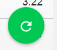

# Pip.WebUI Getting Started <br/> Step 8. Show notifications

[Go to step 7](https://github.com/pip-webui/pip-webui-sample/blob/master/step7/) to add Events page with table view.

### Show notifactions as toast messages

* For a start, we realize the reading of data from the server instead of the dataset. We use for this our fakeserver, 
but you can easily replace it with any real server with the necessary REST API.

* Open filre ./src/events/events.js and replace `/ $scope.events = $scope.dataSet.get('EventsTestCollection').getAll();` by ` var events = $scope.dataSet.get('EventsTestCollection');`

* Make a request to the server, and display the result

```javascript
thisModule.controller('eventsController', function($scope, pipAppBar, $mdMedia, $http) {
    
        // Show page title
        pipAppBar.showTitleText('Events');
        // Show menu icon to open sidenav
        pipAppBar.showMenuNavIcon();
        // Show local page actions
        pipAppBar.showLocalActions();
        // Add shadow under the appbar
        pipAppBar.hideShadow();
        // Initialize service for changing layouts when the screen size changed
        $scope.$mdMedia = $mdMedia;

        var events = $scope.dataSet.get('EventsTestCollection');
        var req = {method: 'GET', url: 'http://fakeserver.net' + '/api/events'};
       
        // Get data from the server
        $http(req)
            .success(function (result) {
                $scope.events = result;  // <---- Pay attention!
            })
            .error(function (error) {
                console.log('Error: get events error! ', error); 
            });    

});
```

* Change the code in node.js

```javascript
    thisModule.controller('nodesController', function($scope, pipAppBar) {

         var req;
         
        // Show page title
        pipAppBar.showTitleText('Nodes');
        // Show menu icon to open sidenav
        pipAppBar.showMenuNavIcon();
        // Show local page actions
        pipAppBar.showLocalActions();
        // Add shadow under the appbar
        pipAppBar.hideShadow();

        // Get test data
        req = {method: 'GET', url: 'http://fakeserver.net' + '/api/nodes'};

        $http(req)
            .success(function (result) {
                $scope.nodes = result;

                $scope.iconPath = 'M0,15a15,15 0 1,0 30,0a15,15 0 1,0 -30,0';

                $scope.location_points = getLocations();            
            })
            .error(function (error) {
                console.log('Error: get nodes error! ', error); 
            }); 

        function getLocations() {
            var points = [];

            $scope.nodes.forEach(function (node) {
                points.push(node.location_points);
            });

            return points;
        }
    });
```

* Here we are going to simulate incoming events and show them as toast messages.

Add the code below into **eventsController**

```javascript
 thisModule.controller('eventsController', function($scope, $interval, $mdMedia, $http, pipAppBar, pipToasts) {

        var req,
            stopTime,
            EVENTS_MAX = 200, // The maximum number of events that can be generated
            events;

        // Show page title
        pipAppBar.showTitleText('Events');
        // Show menu icon to open sidenav
        pipAppBar.showMenuNavIcon();
        // Show local page actions
        pipAppBar.showLocalActions();
        // Add shadow under the appbar
        pipAppBar.hideShadow();
        // Initialize service for changing layouts when the screen size changed
        $scope.$mdMedia = $mdMedia;
        
        // Get test data 
        events = $scope.dataSet.get('EventsTestCollection');

        // Prepare request 
        req = {method: 'GET', url: 'http://fakeserver.net' + '/api/events'};

        // Get data from the server
        $http(req)
            .success(function (result) {
                $scope.events = result;

                stopTime = $interval(addNextToast, 10000); // use angular $interval for imitation receiving messages every 10 sec.            
            })
            .error(function (error) {
                console.log('Error: get events error! ', error); 
            });    

        $scope.iconColors = {
            'warn-circle': '#EF5350',
            'info-circle-outline': '#8BC34A',
            'warn-triangle': '#FFD54F'
        };

        return;

        function addNextToast() {
            var event,
                i = $scope.events.length;

            if (i > EVENTS_MAX) {
                $interval.cancel(stopTime);
            } else {
                // generate event
                event = events.create();

                // get event from server 
                // Prepare request 
                req = {method: 'GET', url: 'http://fakeserver.net' + '/api/events/' + event.id};
                // Get data from the server
                $http(req)
                    .success(function (result) {
                        $scope.events.push(result);
                    })
                    .error(function (error) {
                        console.log('Error: get events error! ', error); 
                    }); 

                // Function to display notification
                pipToasts.showNotification('Node ' + event.node_name + ' (' + event.node_id + '): ' + event.description);
                i++;
            }
        }
    });
```

Rebuild the application. Now every 10 seconds you shall see a toast with event in the left bottom corner.


Add rereading data from the server after you click 'Reload Button'. 



Add this code to **eventsController**.

```javascript
 thisModule.controller('eventsController', function($scope, $interval, $mdMedia, $http, pipAppBar, pipToasts) {
 
        ... 

        Scope.onREload = onReload;

        return;

        ...

        function onReload() {
            var req = {method: 'GET', url: 'http://fakeserver.net' + '/api/events'};

            $http(req)
                .success(function (result) {
                    $scope.events = result;
                })
                .error(function (error) {
                    console.log('Error: get events error! ', error); 
                });  
        }
        
    });
```

Change ./src/events/events.html.

```html
 ...
    <md-button class="md-fab md-accent md-fab-bottom-right" aria-label="refresh"
        ng-click="onReload()">  <!-- Pay attention!  -->
        <md-tooltip md-direction="left">Refresh</md-tooltip>
        <md-icon md-svg-icon="icons:reload"></md-icon>
    </md-button>
 ...
```

### Continue

[Go to step 9](https://github.com/pip-webui/pip-webui-sample/blob/master/step9/) to add map view to Nodes page.
