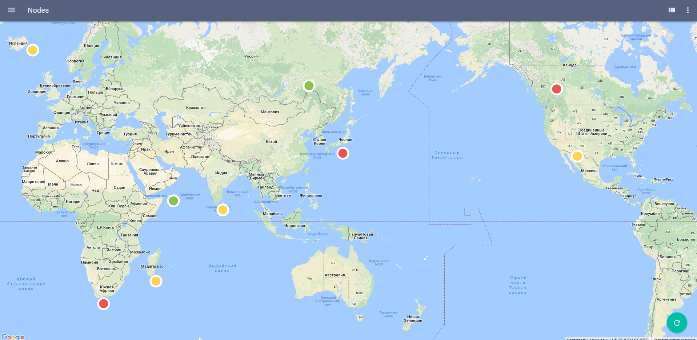

# Getting Started With Pip.WebUI <br/> Step 9. Add a map view to Nodes page

[Go to step 8](https://github.com/pip-webui/pip-webui-tutorial/blob/master/step8/) if you haven't already, to show notifications.

### Create the nodes map view

Rename the **/src/nodes/nodes.html** file to **/src/nodes/nodes_tiles.html**
 and create a **/src/nodes/nodes_map.html** file and add the HTML snippet below:

```html
<pip-simple class="layout-row flex">
    <pip-location-map class="flex" pip-location-positions="vm.locationPoints" pip-draggable="true" pip-stretch="true">
    </pip-location-map>
</pip-simple>
```

### Create the nodes tiles and map controllers

After we split the Nodes page into the tile and map views, the  **nodesController** becomes a parent controller.
We will add two child controllers, **nodesTilesController** and **nodesMapController**, for each view.

Make these changes in the **/src/nodes/nodes.ts** file. Edit **nodesController** by adding **nodesTilesController** and **nodesMapController**:

```javascript

'use strict';

...

class NodesController {
    public constructor(
        pipBreadcrumb: pip.nav.IBreadcrumbService
    ) {
        ...

// >>>> Changes start here >>>>
        this.locationPoints = [
            this.nodes[0].location,
            this.nodes[1].location,
            this.nodes[2].location
        ];
// >>>> Changes end here >>>>
    }

    public nodes: IoTNode[] = [];
// >>>> Changes start here >>>>
    public locationPoints: Point[] = [];
// >>>> Changes end here >>>>
}

// >>>> Changes start here >>>>
class NodesTilesController {
    public constructor(
        pipActions: pip.nav.IActionsService,
        $state: angular.ui.IStateService
    ) {
        pipActions.primaryLocalActions = [
            {
                name: 'nodes.map',
                icon: 'icons:location',
                click: () => { $state.go('nodes.map'); },
                subActions: []
            }
        ];
    }
}

class NodesMapController {
    public constructor(
        pipActions: pip.nav.IActionsService,
        $state: angular.ui.IStateService,
        $timeout: any
    ) {
        pipActions.primaryLocalActions = [
            {
                name: 'nodes.tiles',
                icon: 'icons:grid',
                click: () => { $state.go('nodes.tiles'); },
                subActions: []
            }
        ];
    }
}
// >>>> Changes end here >>>>

angular
    .module('app.Nodes', [ ])
    .config(configureNodeRoutes);

```

## Update the application routes

Inside the **/src/nodes/nodes.ts** file, make some changes to the nodes route config:

```javascript
'use strict';

function configureNodeRoutes(
    $stateProvider: ng.ui.IStateProvider
) {
    "ngInject";

    // Configure module routes
    $stateProvider.state('nodes', {
        url: '/nodes',
        controller: NodesController,
        controllerAs: 'vm',
// >>>> Changes start here >>>>
        template: '<ui-view class="layout-row flex w-stretch"></ui-view>',
        abstract: true
// >>>> Changes end here >>>>
    })
// >>>> Changes start here >>>>
    .state('nodes.tiles', {
        url: '/tiles',
        controller: NodesTilesController,
        templateUrl: 'nodes/nodes_tiles.html'
    })
    .state('nodes.map', {
        url: '/map',
        controller: NodesMapController,
        templateUrl: 'nodes/nodes_map.html'
    });
// >>>> Changes end here >>>>
}
        ...
});
```

Because 'nodes' is now abstract, you need to change the link to nodes tool in the app configuration. 
Open **index.ts** and change the state name of the first link in the first section from 'nodes' to 'nodes.tiles'. Also change the default state.

```javascript
'use strict';

...

function configureApp(
    $mdIconProvider: ng.material.IIconProvider, 
    $urlRouterProvider: any,
    pipSideNavProvider: pip.nav.ISideNavProvider, 
    pipNavMenuProvider: pip.nav.INavMenuProvider, 
    pipAppBarProvider: pip.nav.IAppBarProvider, 
    pipNavIconProvider: pip.nav.INavIconProvider,
    pipActionsProvider: pip.nav.IActionsProvider, 
    pipBreadcrumbProvider: pip.nav.IBreadcrumbProvider, 
 ) {
 
 ...
 
 pipNavMenuProvider.sections = [
        {
            name: 'main',
            links: [
// >>>> Changes start here >>>>
                { name: 'nodes', icon: 'icons:grid', title: 'Nodes', state: 'nodes.tiles' },
// >>>> Changes end here >>>>
                { name: 'events', icon: 'icons:progress', title: 'Events', state: 'events' },
                { name: 'settings', icon: 'icons:config', title: 'Settings', state: 'settings.sample' }
            ]
        },
        {
            name: 'signout',
            links: [
                { name: 'signout', icon: 'icons:exit', title: 'Sign out', event: 'appSignout' }
            ]
        }
    ];
    
...
// >>>> Changes start here >>>>
    $urlRouterProvider.otherwise("/nodes/tiles");
// >>>> Changes end here >>>>
}

```

After all the changes are done, rebuild the application. When you go to the nodes page and toggle the view in the appbar, you should see a map with positions of IoT nodes:



### Continue to step 10

[Go to step 10](https://github.com/pip-webui/pip-webui-tutorial/blob/master/step10/) to add a charts view to the Events page.
